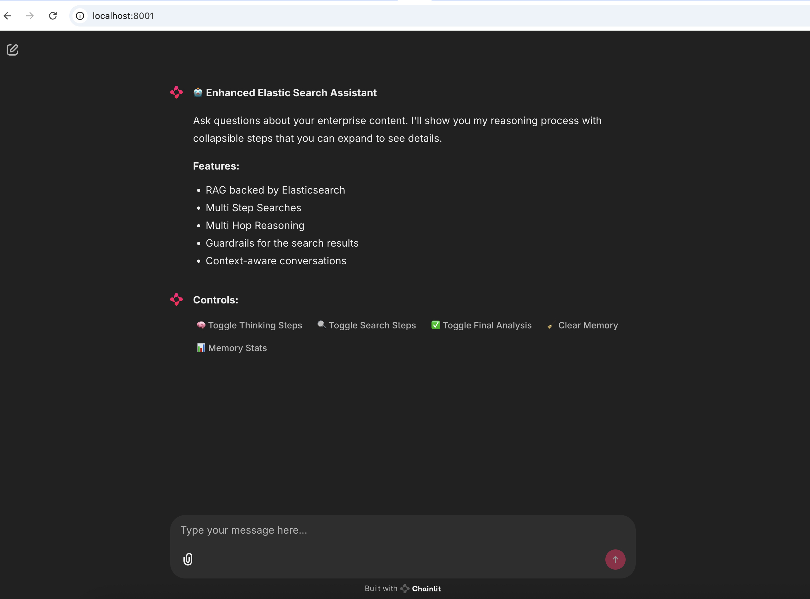

# Enterprise Content RAG Assistant

This project is an enterprise-ready Retrieval-Augmented Generation (RAG) assistant that leverages company documentation and knowledge bases (Jira, Confluence, SharePoint, etc.) to answer user queries using advanced search and LLMs. It consists of two main components:

- **Backend Server (MCP Server)**: FastAPI-based server for content search (Elasticsearch via `server.py`). **This server is sourced from the [Elastic fastmcp-server repository](https://github.com/elastic/elastic-fastmcp-server)** and is required to run this project. You must have this server running for the chatbot to function.
- **Chatbot UI**: Chainlit-based conversational interface powered by LangChain and Azure OpenAI.

   

---

## Features
- Conversational search over enterprise content indices
- Uses Azure OpenAI for LLM-powered answers
- Step-by-step agent reasoning and search transparency
- Memory for chat context and follow-up questions

---

## Requirements
- Python 3.10+
- [Poetry](https://python-poetry.org/) for dependency management (recommended for full project)
- Alternatively, use `requirements.txt` in `chatbot_assistant/chatbot` for just the chatbot UI
- Access to Azure OpenAI (API key, endpoint, deployment)
- Elasticsearch backend with content indices (e.g., `content-jira`, `content-confluence`, `content-sharepoint`)

---

## Setup

1. **Clone the repository**

```bash
git clone <repo-url>
cd enterprise_content_rag_assistant/chatbot_assistant
```

2. **Install dependencies**

**Option 1: Poetry (recommended for full project)**
```bash
poetry install
```

**Option 2: Pip (for just the chatbot UI)**
```bash
pip install -r chatbot/chatbot/requirements.txt
```

3. **Configure environment variables**

Copy the sample env file and fill in your credentials:

```bash
cp .env\ copy.sample .env
```

Edit `.env` and set the following (example):

```
AZURE_OPENAI_API_KEY=your-azure-openai-key
AZURE_OPENAI_ENDPOINT=https://your-resource.openai.azure.com/
AZURE_OPENAI_DEPLOYMENT=your-deployment-name
AZURE_OPENAI_API_VERSION=2023-05-15
```

---

## How to Run

### 1. Start the Backend Server (MCP Server)

The backend server must be started first. It exposes the content search API used by the chatbot.

```bash
poetry run python mcp-server-elasticsearch/chat/server.py
```

This will start the server on `localhost:8000` (default).

> **Note:** The MCP server code is sourced from the [Elastic fastmcp-server repository](https://github.com/elastic/elastic-fastmcp-server). Ensure you have the correct version and configuration as required by your environment.

### 2. Start the Chatbot (Chainlit App)

In a new terminal, run:

```bash
poetry run chainlit run chatbot/chainlit_app.py --port 8001 --watch
```

Or, if you installed dependencies via pip:

```bash
chainlit run chatbot/chainlit_app.py --port 8001 --watch
```

- The chatbot UI will be available at [http://localhost:8001](http://localhost:8001)
- The app will auto-reload on code changes with `--watch`

---

## One-Click Start Script

For convenience, you can use the following script to start both services (requires `bash`):

Create a file named `start_all.sh` in the project root with:

```bash
#!/bin/bash
# Start backend server
poetry run python mcp-server-elasticsearch/chat/server.py &
SERVER_PID=$!
# Wait a few seconds for the server to start
sleep 3
# Start Chainlit app
poetry run chainlit run chatbot/chainlit_app.py --port 8001 --watch
# When Chainlit exits, stop the server
kill $SERVER_PID
```

Make it executable:

```bash
chmod +x start_all.sh
```

Then run:

```bash
./start_all.sh
```

---

## Project Structure

- `chatbot/chainlit_app.py` — Chainlit UI app
- `chatbot/langchain_agent.py` — LangChain agent logic
- `mcp-server-elasticsearch/chat/server.py` — Backend search server (from Elastic fastmcp-server)
- `src/elastic/mcp/fastmcp/` — Core backend logic

---

## Testing

Run tests with:

```bash
poetry run pytest
```

---

## License

See [LICENCE.txt](LICENCE.txt)
